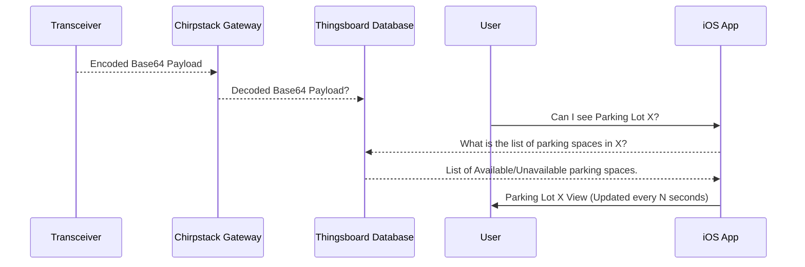

# smart-park
This repository contains the files used for  all code written by the **Computer Science** team of **Smart Park**.

For the **2022 Spring Semester** we have decided to *revamp* the iOS app.  The old repo from the **2021 Fall Semester** can be found here,
 - https://github.com/wsu-senior-design/smartparking-deprecated 

## Features
 - The current iOS app now contains functionality from the MapKit library to have a UI similar to that of Apple Maps.
 - Arduino code written to connect transceivers to the ChirpStack gateway.
## To-do
- Pull logic from the old iOS app to make API calls to ThingsBoard and update parking spaces.
- Optimize logic for dynamically creating parking space annotations within the iOS app.
- Dockerize base Django/React files for web application.

## UML diagrams

