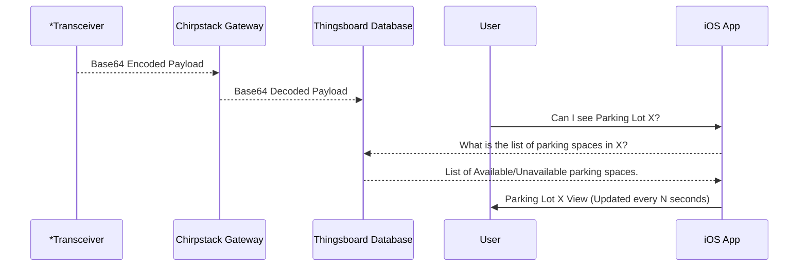

# smart-park
This repository contains the files used for  all code written by the **Computer Science** team of **Smart Park**.

The purpose of our project is to create a mobile iOS application for students to view parking spaces in real time and see what spaces are available or taken.

For the **2022 Spring Semester** we have decided to *revamp* the iOS app.  The old repo from the **2021 Fall Semester** can be found here,
 - https://github.com/wsu-senior-design/smartparking-deprecated 
   - We have sucessfully updated parking spaces from physical transceiver all the way to the mobile iOS app. This repository contains the fully functioning code for the prototype.

## Changelog
 - The current iOS app now contains functionality from the MapKit library to have a UI similar to that of Apple Maps.
 - Arduino code written to connect transceivers to the ChirpStack gateway.
## To-do
- Pull logic from the old iOS app to make API calls to ThingsBoard and update parking spaces.
  - Reauthenticate bearer token.
- Optimize logic for dynamically creating parking space annotations within the iOS app.
- Dockerize base Django/React files for web application.
  - Create customizable dashboards for data analytics.

## UML diagrams

*Transceiver - hardware sitting in a single parking space.